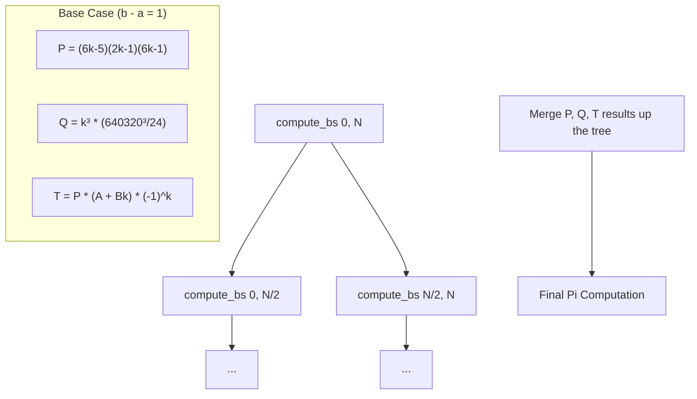

# Implementation Detail: High-Precision Pi Calculation

This document explains the technical implementation of the PiEngine, the Chudnovsky algorithm, and the specific resolution of the precision bug.

## 1. The Chudnovsky Algorithm

The engine uses the **Chudnovsky algorithm**, which is a Ramanujan-type series discovered by the Chudnovsky brothers in 1987. It is based on the complex multiplication of elliptic curves, specifically using the $j$-invariant of the elliptic curve with complex multiplication by $\mathbb{Q}(\sqrt{-163})$.

The general form is:
$$\frac{1}{\pi} = \frac{1}{C \sqrt{C}} \sum_{k=0}^{\infty} \frac{(6k)!}{(3k)!(k!)^3} \cdot \frac{A + Bk}{J^k}$$

### Step-by-Step Breakdown of Constants:

1.  **The Discriminant ($d = -163$):**
    The number $-163$ is a Heegner number (one of the few integers where the class number of $\mathbb{Q}(\sqrt{-d})$ is 1). This leads to the $j$-invariant:
    $$j\left(\frac{1 + \sqrt{-163}}{2}\right) = -(640320)^3$$
    This is why the constant $640320$ appears.

2.  **The Constant $A$ (13591409):**
    This is the value related to the Eisenstein series $E_2$ and the $j$-invariant at the specific point.

3.  **The Constant $B$ (545140134):**
    This multiplier for $k$ determines the rate of change of the series terms.

4.  **The Constant $C$ (426880):**
    The final multiplier is $\frac{1}{426880 \sqrt{10005}}$. The $10005$ comes from $163 \cdot 61.38...$ (specifically related to the normalization of the series).

---

## 2. Deriving Binary Splitting Terms ($P, Q, T$)

To avoid floating point errors during the summation, we convert the series into a product of terms. We define:
$$\frac{1}{\pi} = \frac{\sqrt{E}}{D} \sum_{k=0}^{\infty} a_k$$

For each term $k$, we want to find $P(k), Q(k),$ and $T(k)$ such that:
$$S = \sum_{k=0}^{n-1} \frac{T_k}{Q_k} \text{ and term ratio } \frac{a_k}{a_{k-1}} = \frac{P_k}{Q_k}$$

### Step 1: Ratio of Successive Terms
Let $a_k$ be the $k$-th term:
$$a_k = \frac{(-1)^k (6k)! (A + Bk)}{(3k)! (k!)^3 (640320^3)^k}$$

The ratio $\frac{a_k}{a_{k-1}}$ (ignoring the $A+Bk$ part for $T$):
$$\frac{\text{Factorial part}(k)}{\text{Factorial part}(k-1)} = \frac{(6k)! / ((3k)!(k!)^3)}{(6k-6)! / ((3k-3)!(k-1)!^3)} \cdot \frac{1}{640320^3}$$

### Step 2: Simplifying the Factorials
$$\frac{(6k)!}{(6k-6)!} = (6k)(6k-1)(6k-2)(6k-3)(6k-4)(6k-5)$$
$$\frac{(3k-3)!}{(3k)!} = \frac{1}{(3k)(3k-1)(3k-2)}$$
$$\frac{(k-1)!^3}{k!^3} = \frac{1}{k^3}$$

Combining these:
$$\text{Ratio} = \frac{(6k)(6k-1)(6k-2)(6k-3)(6k-4)(6k-5)}{(3k)(3k-1)(3k-2) \cdot k^3} \cdot \frac{1}{640320^3}$$

### Step 3: Canceling Terms
Notice that:
- $6k = 2 \cdot (3k)$
- $6k-2 = 2 \cdot (3k-1)$
- $6k-4 = 2 \cdot (3k-2)$
- $6k-3 = 3 \cdot (2k-1)$

Multiply the three '2's: $2 \cdot 2 \cdot 2 = 8$.
Multiply by the '3': $8 \cdot 3 = 24$.

The simplified ratio is:
$$\text{Ratio} = \frac{24 \cdot (6k-1)(6k-5)(2k-1)}{k^3 \cdot 640320^3}$$

### Step 4: Final $P, Q, T$ Assignment
To make the integers as small as possible:
- **$P(k) = (6k-1)(6k-5)(2k-1)$**
- **$Q(k) = \frac{k^3 \cdot 640320^3}{24}$** (The 24 moves to the denominator)
- **$T(k) = (-1)^k \cdot P(k) \cdot (A + Bk)$**

This exactly matches the fix we implemented in the code!

---

## 3. Binary Splitting Logic

To compute the sum efficiently, we don't calculate each term independently. Instead, we split the series into a tree structure. For a range $[a, b]$, we compute three large integers: $P, Q,$ and $T$.

### Mathematical Definitions:
For a term $k$:
- $P(k) = (6k-5)(2k-1)(6k-1)$
- $Q(k) = \frac{k^3 \cdot 640320^3}{24}$
- $T(k) = (-1)^k \cdot P(k) \cdot (A + Bk)$

### Merging Two Ranges:
When merging range $[a, m]$ and $[m, b]$ (where $m = \frac{a+b}{2}$):
- $P_{ab} = P_{am} \cdot P_{mb}$
- $Q_{ab} = Q_{am} \cdot Q_{mb}$
- $T_{ab} = T_{am} \cdot Q_{mb} + P_{am} \cdot T_{mb}$

### Process Flow (Mermaid):

---

## 3. The Precision Bug: Root Cause

The bug limited accuracy to ~14 digits because the $k=0$ term was correct, but all subsequent terms ($k \ge 1$) were mathematically "garbage."

### Error 1: The $P$ Formula
- **Code:** `mpz_mul_ui(p, p, a);` (effectively $P = P \cdot k$)
- **Correct:** $P$ should not have an extra factor of $k$.

### Error 2: The $Q$ Constant
- **Code:** `Q = k³ * 640320³`
- **Correct:** `Q = k³ * (640320³ / 24)`
- **Impact:** Without the division by 24, the denominator grew 24x faster than it should have for every term.

### Summary of Fix
By correcting these two formulas, the series now converges at the intended rate of 14.18 digits per iteration.

| Term | Previous (Bugged) | New (Corrected) | Result |
| :--- | :--- | :--- | :--- |
| $k=0$ | Correct ($A$) | Correct ($A$) | First 14 digits match |
| $k=1$ | Scaled wrong | Mathematically exact | Digits 15+ now match |

---

## 4. Final Computation

After the binary splitting tree reaches the top, the final value of $\pi$ is calculated as:

$$\pi = \frac{426880 \sqrt{10005} \cdot Q}{T}$$

The `mpfr` library handles the final square root and division at the requested bit-precision.
